# Le jeu de base

Dans cette partie, tu construis le jeu : un joueur qui bouge, qui tire, des ennemis qui arrivent
et un score qui monte.

# Intro

- TIC-80
- Environment
- init -> loop: update, draw

# Mouvement joueur

## Sprite
<!-- ws: {type: exercise, id: mouvement-joueur-sprite} -->

- TIC-80 Sprite Editor: Santa Hat
- Position initiale
- Nommer les variables player_x, player_y (comme player_speed)
- Code: Draw Sprite


Boite à outil:

Ouvre le studio de TIC-80 pour dessiner ton premier sprite.
<!-- illustration: cli TIC80, type `studio`, the sprite editor is open -->

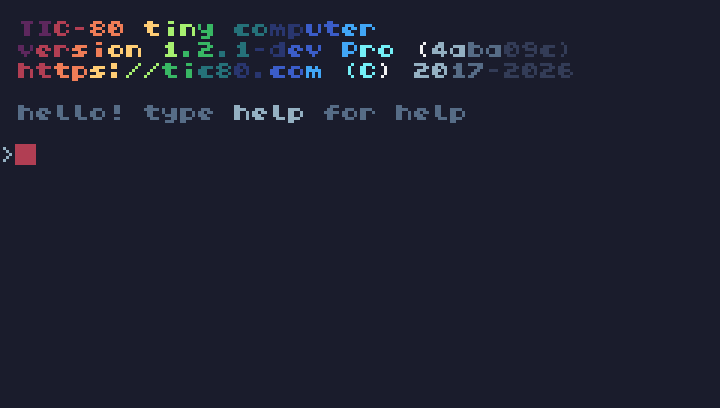

Dessine le sprite qui servira à représenter le joueur:
<!-- illustration: in sprite editor draw this sprite (one tile) pixel by pixel -> 000:c2000000c2220000c2222000c22222ccc22222ccc2222000c2220000c2000000 -->

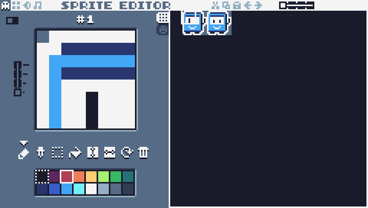


Placer le sprite sur l'écran.
`spr(id, x, y)`
`spr`: Je veux un sprite sur l'écran
    - `id`: Quel sprite ?
    - `x` et `y`: à quel endroit sur l'écran ?
<!-- doc: anchor doc TIC-80 spr -->

Exemple :

```lua
spr(17, 20, 100)   -- le sprite numéro 17, en x = 20 et y = 100
spr(17, 60, 100)   -- le même sprite, 40 pixels plus à droite
```

Écris `spr` après `cls` : `cls` efface tout l'écran, donc un sprite dessiné avant disparaît.

Doc : https://github.com/nesbox/TIC-80/wiki/spr


Mise en application:
Dessine ton sprite et utilise l'éditeur de code pour faire apparaître ton sprite sur l'écran de jeu.

En lançant le jeu tu dois obtenir:
<!-- illustration: a sprite drawn on screen, no transparency -->

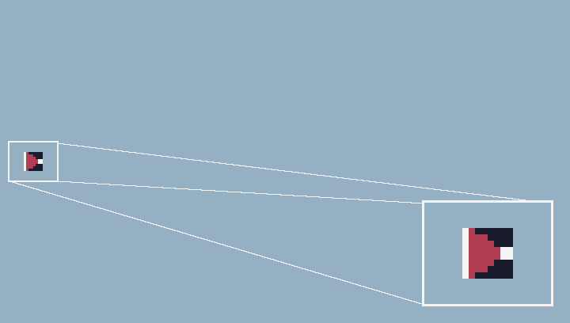

Transparence, ajoute l'index de la couleur transparente à spr
`spr(id, x, y, key)`

Exemple : le sprite numéro 17 est dessiné sur un fond violet, la couleur 1. Pour que ce fond disparaisse :

```lua
spr(17, 20, 100, 1)
```

Tous les pixels de la couleur 1 deviennent invisibles. Pour trouver le numéro d'une couleur, compte les cases de la palette en partant de 0 : la ligne du haut va de 0 à 7, la ligne du bas de 8 à 15.
<!-- illustration: sprite editor's palette: highlight the color that should be used as the colorkey -->

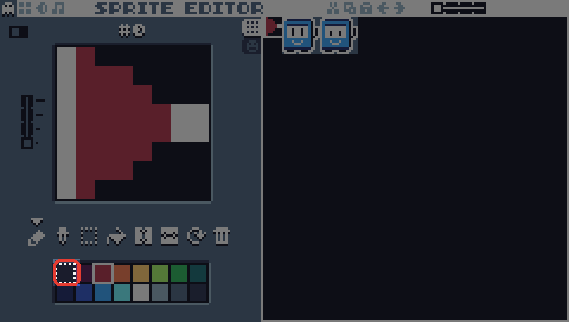

Relance le jeu, tu dois obtenir:
<!-- illustration: a sprite drawn on screen, with transparency -->

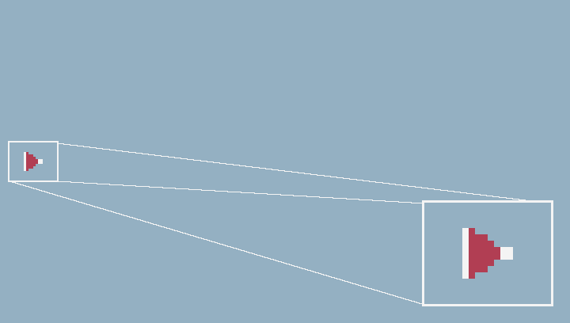


## Input
<!-- ws: {type: exercise, id: mouvement-joueur-input} -->

- if btn(x): update position
- limites bordures écran

Un sprite qui s'affiche est un bon début, maintenant il faut pouvoir déplacer ce sprite

Boite à outil:

**Variable** : une boîte avec un nom, qui garde une valeur.

```lua
vies = 3
print(vies)   --> 3
```

Crée tes variables en haut du code, en dehors de `function TIC()`. Sinon, elles reprennent leur valeur de départ 60 fois par seconde.

**Incrémenter / décrémenter** : changer une variable à partir de sa valeur actuelle.

```lua
compteur = 0
compteur = compteur + 1
compteur = compteur + 1
print(compteur)   --> 2
compteur = compteur - 1
print(compteur)   --> 1
```

Lua calcule d'abord ce qui est à droite du `=` (`compteur + 1`), puis range le résultat dans `compteur`.

**`btn(numéro)`** : vrai tant que le bouton est appuyé.

| Numéro | Touche du clavier |
|---|---|
| 0 | flèche haut |
| 1 | flèche bas |
| 2 | flèche gauche |
| 3 | flèche droite |
| 4 | Z |
| 5 | X |

Doc : https://github.com/nesbox/TIC-80/wiki/btn

**`if`** : faire quelque chose seulement quand une condition est vraie.

```lua
temperature = 35
if temperature > 30 then
  print("il fait chaud")
end
--> il fait chaud
```

Avec `temperature = 20`, rien ne s'affiche. Chaque `if` se ferme avec un `end`.

Mise en application:

Fait en sorte de déplacer le sprite du joueur si appuie sur les flèches du clavier.
Crée deux variables `x` et `y`
Lors de l'appuie sur une flèche fait varier `x` ou `y`.
Utilise `x` et `y` dans la fonction `spr` à la place des valeur en dur.

<!--illustration: animation of the end of this step. note les animations qui montre l'effet d'un input sur le jeu doivent avoir un overlay "manette" qui montrent les touches utilisée au moment exact où elle sont utilisée. --> 

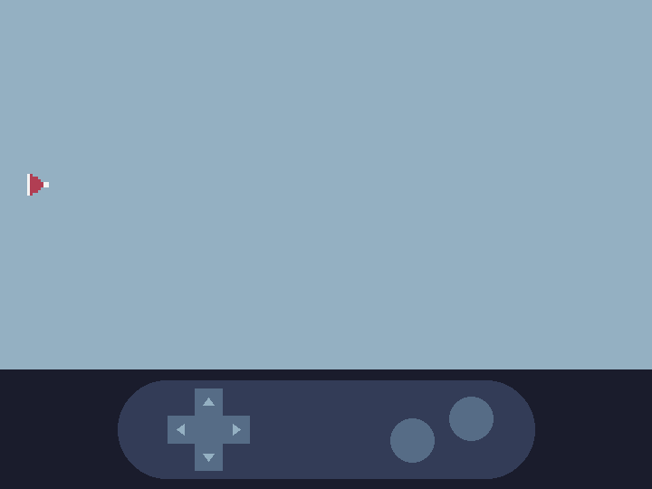


## Rester dans les limites de écran


Si tu déplace trop ton sprite en jouant, celui peut quitter l'écran.

L'écran sur TIC-80 fait 240 pixels de large et 136 pixels de haut. Le point (0,0) se situe en haut à gauche de l'écran.
<!-- illustration: Axis and screen boundaries -->

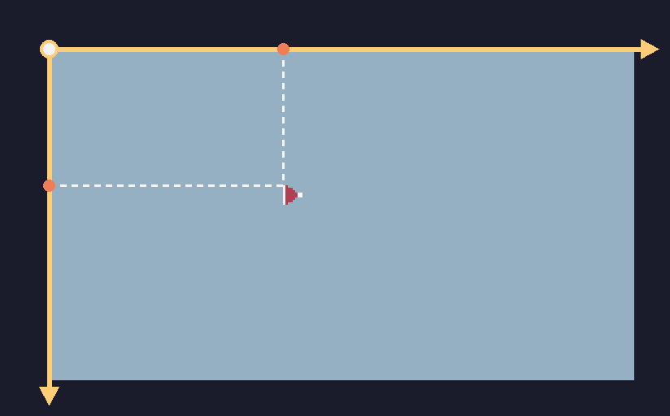


Mise en application:

Ajoute des conditions qui empêchent le joueur de sortir de l'écran.
Ces conditions doivent faire en sorte que:
- La position du joueur peut varier que s'il ne rencontre pas un bord de l'écran <!-- note: détailler les 4 bords de l'écran -->

<!-- illustration: 2 animations: avant et après la gestion des limites -->

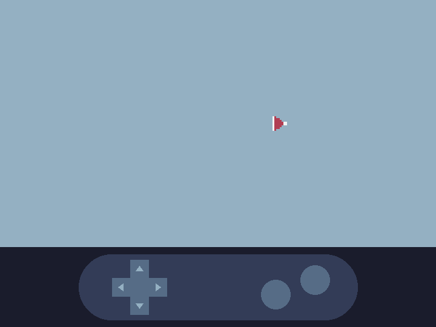


# Bullet

## Sprite
<!-- ws: {type: exercise, id: bullet-sprite} -->

- TIC-80 Sprite Editor: Bullet
- Position initiale: out of bound


Un joueur qui bouge c'est bien,  un joueur qui bouge et qui tire c'est mieux.


Mise en application:

- Dessiner un nouveau sprite: missile
- Comment placer ce sprite ? Utilise la fonction `spr` pour affiche ton missile (la même fonction que tu as utilisé pour afficher ton joueur à l'écran),
- La position du missile doit changer pendant la partie: variable `mx`, `my`.
    - Positioner le missile en position (10, 10) pour le moment


## Input
<!-- ws: {type: exercise, id: bullet-input} -->

- if btn(x): shoot at player coordinate
- déplacement du bullet
- out of bound reset


Le sprite du missile existe, mais le joueur n'est pas encore capable de le tirer

Boite a outil:

Vecteur vitesse.
C'est quoi un vecteur de vitesse ?
mx = mx + vmx
<!-- illustration: explication complète d'un vecteur de vitesse avec plusieurs image et animations -->

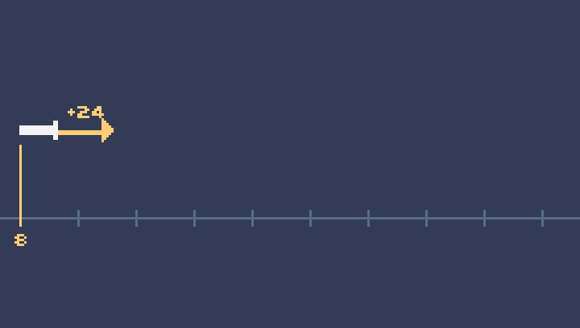

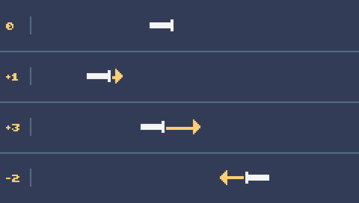

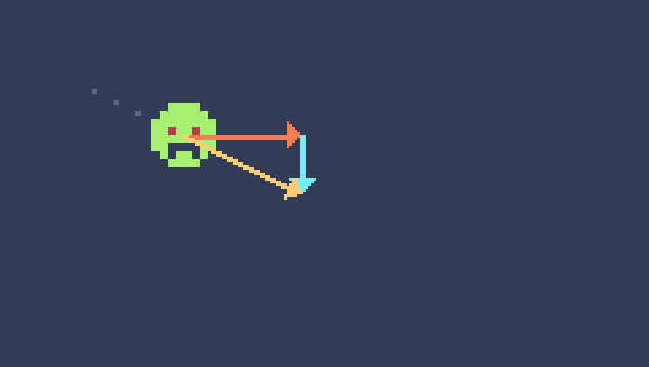

Exemple :

```lua
position = 0
vitesse = 3
position = position + vitesse
print(position)   --> 3
position = position + vitesse
print(position)   --> 6
```

Dans un jeu, la ligne `position = position + vitesse` est exécutée à chaque image : l'objet avance de 3 pixels par image. Essaie d'autres valeurs pour `vitesse` :

| `vitesse` | La position... |
|---|---|
| `1` | augmente doucement |
| `5` | augmente vite |
| `-2` | diminue |
| `0` | ne change pas |

La vitesse est une variable comme les autres : tu peux la changer pendant la partie, et le mouvement change aussitôt.

Mise en application:

Tu dois faire en sorte que:

Le tir se déclenche au moment où un joueur appuie sur un bouton. Quelle doit être la valeur initiale du vecteur vitesse (le joueur n'a pas encore appuyé sur le bouton de tir) ?
Le tir va tout droit. Que doit t'on changer au vecteur vitesse du missible pour le faire avancer tout droit ?
Lorsque le joueur tire, le missile commence sa trajectoire à l'endroit où se trouve le joueur et continue jusqu'au bord droit de l'écran.


## Logique additionnelle

Si le joueur appuie de manière répétitive sur le bouton de tir, le missile semble se re-téléporter sur la position du joueur alors qu'il a déjà été tiré, c'est pas terrible.

<!-- illustration: montre que spammer le bouton de tir reset le missile à la position du joueur. Avec overlay -->

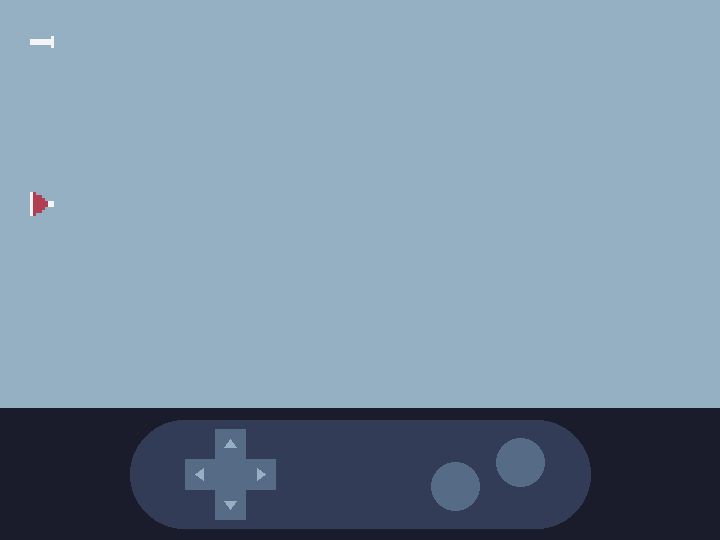


Boite a outil:

**`==`** : est-ce que deux valeurs sont égales ?

```lua
vies = 0
print(vies == 0)   --> true
print(vies == 3)   --> false
```

Attention : `=` range une valeur dans une variable, `==` compare deux valeurs. `if vies = 0 then` provoque une erreur.

**`and`** : deux conditions qui doivent être vraies en même temps.

Au cinéma, on entre si on a au moins 12 ans ET un billet :

```lua
age = 15
billet = true
print(age >= 12 and billet)   --> true
billet = false
print(age >= 12 and billet)   --> false
```

Si une seule des deux conditions est fausse, le résultat est `false`.

Doc : https://www.lua.org/manual/5.3/manual.html#3.4.4


Mise en application:

Modifier la logique de tir et y ajouter une condition: le missile est tiré uniquement si le joueur appuie sur le bouton de tir ET que le missile n'a pas déjà été tiré.
Comment savoir si le missile n'a pas déjà été tiré ? Sa vitesse horizontale est nulle.
Resultat intermédiaire:

<!-- illustration: montre que spammer le bouton de tir ne reset plus le missile à la position du joueur. Avec overlay -->


Le problème maintnenant: le missile peut quitter l'écran et continuer sa course indéfiniment: on ne peut donc plus tirer qu'une seule fois.
Ajouter une condition: si le missile dépasse le bord droit de l'écran: le remettre à sa position initiale et remettre son vecteur vitesse à 0.

Petite modification esthétique (mais bien utile pour la suite):
La position initiale du missile se trouve sur l'écran de jeu. Il est toujours visible même lorsqu'il n'est pas tiré.
Tu peux mettre la position initiale du missile en dehors de l'écran par exemple en: -10, -10

<!-- illustration: montrer le missile en dehors de l'écran de jeu -->

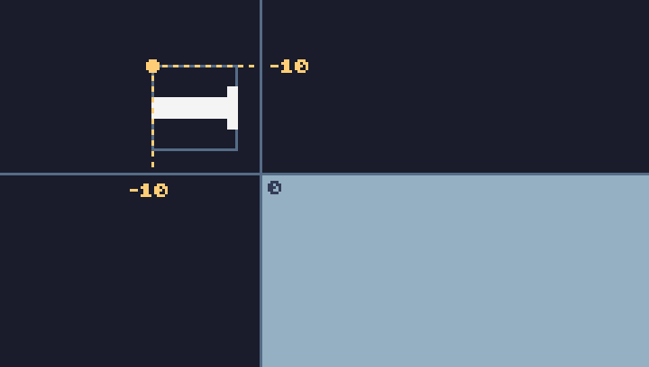


# Enemy

## Sprite
<!-- ws: {type: exercise, id: enemy-sprite} -->

- TIC-80 Sprite Editor: Enemy
- Position initiale: X = out of bound (droite), Y = random


Utilise l'éditeur de sprite pour déssiner un ennemi.


Mise en application:

Dessine ton sprite..
Place le temporairement à un endroit visible à l'écran avec la fonction `spr`.

<!-- illustration: Le joueur et un enemy affiché à l'écran --> 

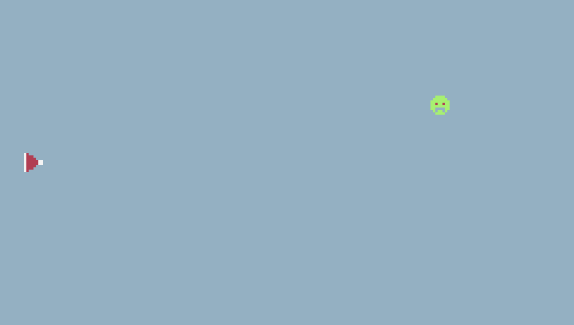


## Mouvement
<!-- ws: {type: exercise, id: enemy-mouvement} -->

- Vers la gauche
- Out of bound (gauche) retour à droite, Y = random

L'ennemi bouge tout seul du bord droit vers le bord gauche. Donne lui une possition horizontale légèrement en dehors de l'écran. Sa position verticale est aléatoire.
Lorsque l'ennemi sort de l'écran par le bord droit ré-initialise sa position.

Boite à outil:

**`math.random(min, max)`** : un nombre entier au hasard, entre `min` et `max`.

```lua
de = math.random(1, 6)
print(de)   --> 4 (ou 1, 2, 3, 5, 6 : comme un dé)
print(math.random(0, 20))   --> un nombre entre 0 et 20
```

Chaque appel donne un nouveau nombre. Pour choisir `min` et `max`, demande-toi quelle est la plus petite et la plus grande valeur qui a du sens.

Doc : https://www.lua.org/manual/5.3/manual.html#pdf-math.random

**Vecteur vitesse : de gauche à droite ou de droite à gauche** : le signe de la vitesse donne le sens.

```lua
x = 100
vitesse = -2
x = x + vitesse
print(x)   --> 98
x = x + vitesse
print(x)   --> 96
```

`x` diminue : l'objet va vers la gauche. Avec `vitesse = 2`, `x` augmente et l'objet va vers la droite. Regarde l'animation avec les quatre missiles, plus haut : le missile à `-2` recule.


Mise en application:
Comme pour le joueur précédent tu auras besoin de variables qui vont représenter:
    - La position en X de l'ennemi: `ex`
    - La position en Y de l'ennemi: `ey`
    - Sa vitesse en X: `vex`
    - Sa vitesse en Y: `vey` 
Donne une vitesse à ton ennemi sur l'axe horizontal.
A l'aide d'une condition: detecte si l'ennemi qui l'écran par le bord droit, dans ce cas ré-initialise sa position.

<!-- illustration: animation de l'ennemi qui traverse plusieurs fois l'écran de droite à gauche, la position horizontale est aléatoire à chaque passe -->

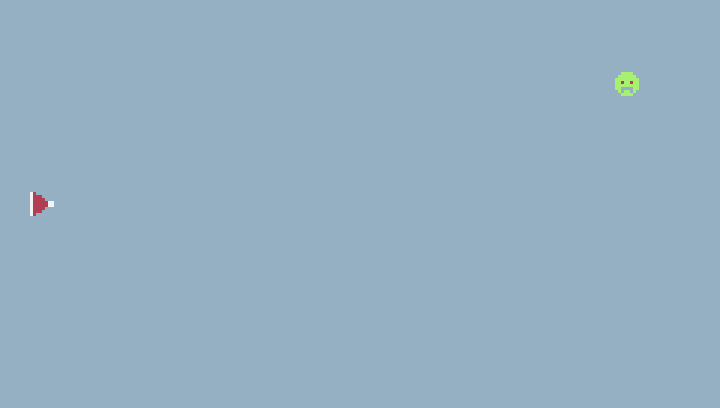

# Collision

- AABB

## Enemy VS Player
<!-- ws: {type: exercise, id: collision-enemy-player} -->

- Reset position player
- Reset position enemy

Boite à outil:
Collision AABB
    - Bounding box: <!--note / illustration: montrer les dimension d'un sprite -->

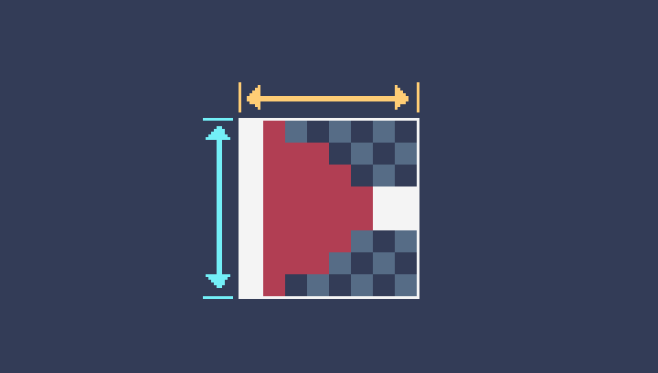
    - Trouver la bounding box: <!--note / illustration: position X d'un sprite + largeur et position Y d'un sprite + hauteur -->

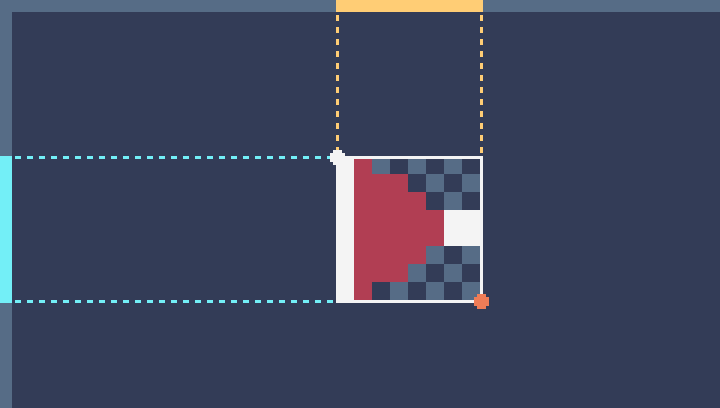
    - <!-- illustration: 2 sprites avec leur collision box visible, une image où il n'y a pas collision, une image où il y a collision -->

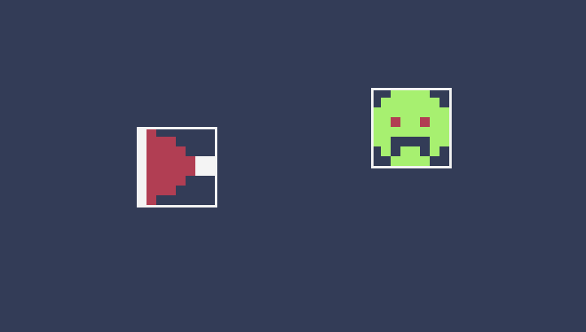

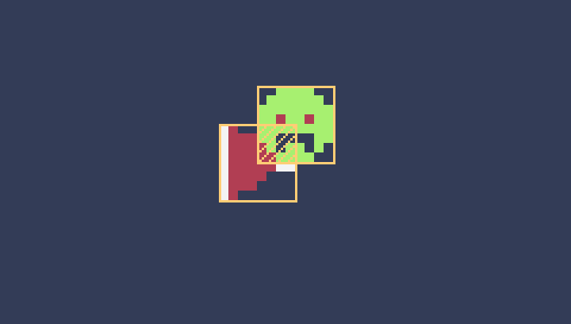

Exemple : commence par une seule règle, au lieu d'un écran.

- Le segment A va de 10 à 18, le segment B va de 15 à 23 : ils se chevauchent.
- Le segment A va de 10 à 18, le segment B va de 20 à 28 : ils ne se chevauchent pas.

Compare le début et la fin de chaque segment dans ces deux cas. Quelles comparaisons sont vraies dans le premier cas, et fausses dans le deuxième ?

Deux boîtes se touchent quand elles se chevauchent sur l'axe X et aussi sur l'axe Y.


Utilise une condition pour détecter la collision entre le joueur et l'ennemi.
Lorsqu'il y a une collision: ré-initialiser la postion de l'ennemi et du joueur.


## Enemy VS Bullet
<!-- ws: {type: exercise, id: collision-enemy-bullet} -->

- Reset position bullet
- Reset position enemy
- Increment score
- Display score


Même chose que pour l'étape précédente: détecter la collision entre le missile et l'ennemi. 
Lorsque le joueur touche l'enemi son score augmente.


Boite à outils:

**`print(texte, x, y, couleur)`** : écrire sur l'écran.

```lua
print("BONJOUR", 10, 20)   -- le texte BONJOUR, en x = 10 et y = 20
```

Écris `print` après `cls`, sinon le texte est effacé tout de suite.

**`..`** : coller deux morceaux de texte.

```lua
vies = 3
print("VIES: " .. vies)   --> VIES: 3
```

Doc : https://github.com/nesbox/TIC-80/wiki/print

**Incrémenter une variable** : tu l'as déjà fait pour déplacer le joueur. Pour ajouter 10 d'un coup :

```lua
pieces = 0
pieces = pieces + 10
print(pieces)   --> 10
```

Mise en application: pour la collision entre l'enemi et le missile inspire-toi de l'étape précédente.
Ajoute une variable `score` à ton code (sa valeur initiale est à 0).
Au quand le missile du joueur touche l'ennemi: augmente le score de 100. 

<!-- illustration: le joueur tire sur l'enemi, le missile et l'ennemi disparaisent, le score augemente de 100 points -->

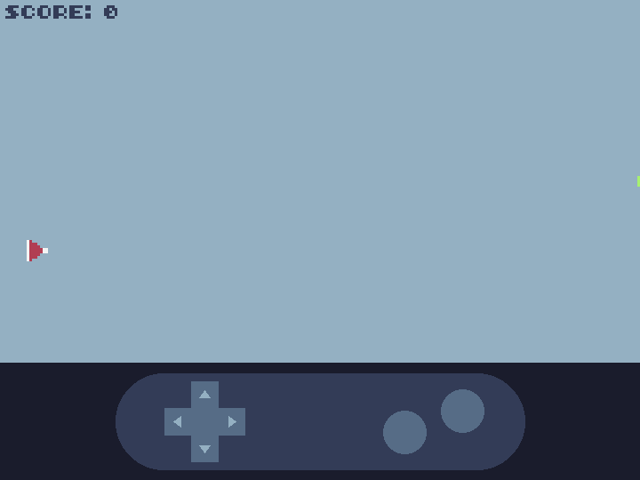


## Bonus: Fonction check_collision
<!-- ws: {type: exercise, id: collision-check-collision} -->

- Une fois les deux tests de collision ecrits, remarquer qu'ils font le meme calcul avec des variables differentes
- Deplacer ce calcul dans une fonction check_collision, c'est beaucoup plus propre et fortement recommande des qu'un meme code est ecrit deux fois

## Fin de la partie 1

Ton jeu est jouable : le joueur bouge, il tire, les ennemis arrivent et le score monte.

Dans la partie suivante, tu vas t'occuper de ce que le joueur voit.
